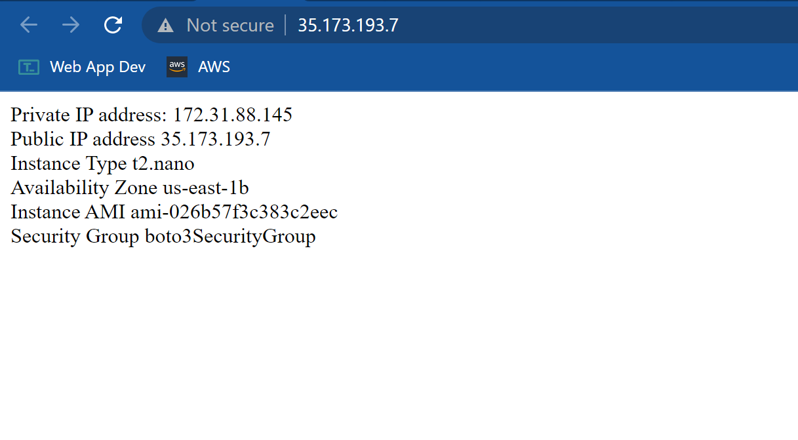
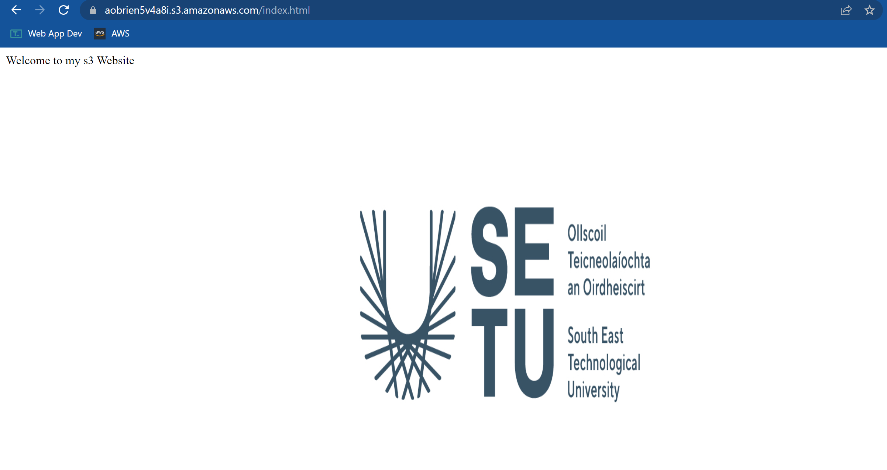
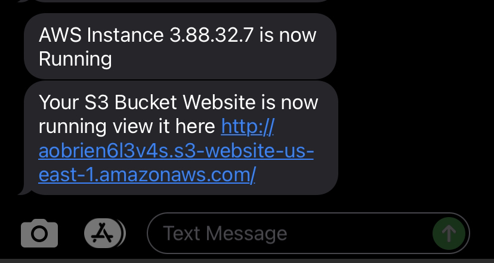

# DevOps-AWS-Automation

Developer Operations Assignment 1

# Ec2 Instance displaying relevant metadata

# S3 Bucket W/SETU logo being displayed

# Amazon SNS being used to show when instances and buckets are active

